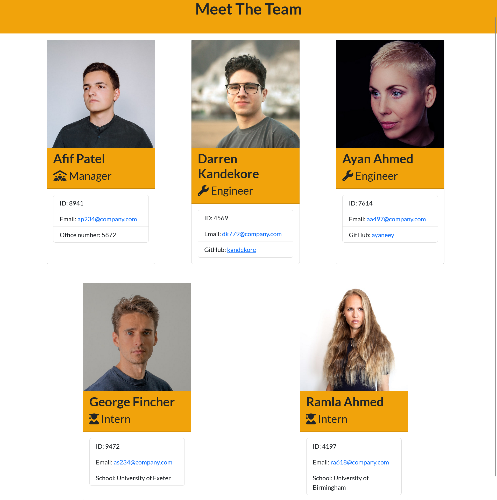

# team-profile-generator

a Node.js command-line application that takes in information about employees on a software engineering team and generates an HTML webpage that displays summaries for each person.

## Table of Contents 📃

1. [Description](#description)
2. [Screenshot](#screenshots)
3. [Installation](#installation)
4. [Usage](#usage)
5. [Video Walk Through](#video-walk-through)
6. [Technology](#technology)
7. [Features](#features)
8. [Credits](#credits)
9. [License](#license)
10. [Contribution Guidelines](#contribution-guidelines)
11. [Feedback](#feedback)
12. [Socials](#socials)

## Description

The purpose of this application is to create a command-line application that can take in user inputs and use those inputs to generate A team profile HTML page.

The application has a number of features which include:

- Accepting user inputs
- When all the user inputs have been accepted then a completed team-page is rendered in the dist/ directory
- When the GitHub username is clicked, their profile is opened up in a new tab
- The default email program is opened when the email address of the employee is selected
- All employees can have the following data input and rendered:
  1. name
  2. employee ID
  3. email address
  4. path to stored img of employee
- Managers can have their office number input and rendered
- Engineers can have their github username input and rendered
- Interns can have their school input and rendered

### User Story 👤

AS A manager
I WANT to generate a webpage that displays my team's basic info
SO THAT I have quick access to their emails and GitHub profiles

### What did I Learn 🏫

Probably the most important aspect of this project was learning how to use the principles of OOP(object orientated programming). Specifically how to use classes correctly.

Other things I learned:

- Furthered my knowledge of inquirer
- Learned how to implement the principles of Test Driven Development by using Jest
- Learned more about how to structure my applications

## Screenshots

## Installation

In order to install this note taker app and test it you need to follow these steps.

1. Ensure that you have node and npm installed

   - [Download Node](https://nodejs.org/en/download/)

   - For detailed instructions on installing node please follow [this link](https://docs.npmjs.com/downloading-and-installing-node-js-and-npm) for instructions

2. Clone this repository into your local repository.

   - `git clone git@github.com:TheInfamousGrim/team-profile-generator.git`.

3. Install the dependencies

   - `npm install`

If you've followed these steps correctly then the application should be good to go and can be tested using software like [Insomnia Core](https://insomnia.rest/) 😁

## Usage

Please follow these steps to use the application

1. Run the following script from your terminal

   - `npm run start`

## Video Walk Through

[Video Link](https://youtu.be/ZCNmQvhZBco)

## Technology

The technology used for the development of this app was:

dev-dependencies:

- [jest](https://www.npmjs.com/package/jest)

dependencies:

- [inquirer](https://www.npmjs.com/package/inquirer)

## Features

- Uses express.js to create and run a server
- Updates a JSON file when creating and deleting notes
- Has a functional API
- Deployed to heroku

## Credits

🙏 Made with the help of:

- [University of Birmingham Coding Bootcamp](https://www.birmingham.ac.uk/postgraduate/courses/cpd/coding-boot-camp.aspx)

## License

[MIT License](/LICENSE)

## Contribution Guidelines

I'm open to have anyone jump in and contribute just message me on [twitter](https://twitter.com/VaporWhy)

Please follow the contribution guidelines!
[Guidelines for contributing](/code_of_conduct.md)

## Feedback

Any feedback please email [George Fincher](mailto:finchergeorge1@gmail.com)

## Socials

GitHub: [TheInfamousGrim](https://api.github.com/users/TheInfamousGrim)

